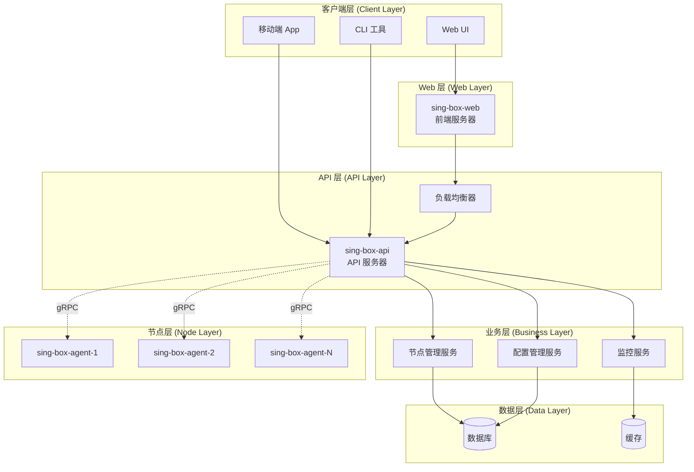

# sing-box-web 工程化设计文档

## 1. 整体项目结构 (Project Structure)

基于 Golang 最佳实践，参考 Karmada-Manager 的清晰结构和 frp 的 gRPC 设计，我们的项目目录布局如下：

```
sing-box-web/
├── api/                            # API 定义和生成代码
│   ├── proto/                      # Protocol Buffers 定义
│   │   ├── common/                 # 通用消息定义
│   │   │   ├── v1/
│   │   │   │   ├── common.proto    # 通用类型（节点、监控指标等）
│   │   │   │   └── config.proto    # 配置相关消息
│   │   │   └── ...
│   │   ├── manager/                # Manager 服务 API
│   │   │   ├── v1/
│   │   │   │   ├── service.proto   # Manager gRPC 服务定义
│   │   │   │   └── types.proto     # Manager 特定类型
│   │   │   └── ...
│   │   └── agent/                  # Agent 服务 API
│   │       ├── v1/
│   │       │   ├── service.proto   # Agent gRPC 服务定义
│   │       │   └── types.proto     # Agent 特定类型
│   │       └── ...
│   ├── generated/                  # 自动生成的 gRPC 代码
│   │   ├── go/                     # Go 语言生成代码
│   │   │   ├── common/v1/
│   │   │   ├── manager/v1/
│   │   │   └── agent/v1/
│   │   └── openapi/                # OpenAPI/Swagger 文档
│   └── client/                     # 客户端 SDK
│       ├── go/                     # Go 客户端
│       └── typescript/             # TypeScript 客户端（供前端使用）
├── cmd/                            # 应用程序入口点
│   ├── sing-box-api/               # API 服务器应用 (后端)
│   │   ├── app/                    # 应用逻辑
│   │   │   ├── options/            # 命令行选项
│   │   │   ├── grpc/               # gRPC 服务器模块
│   │   │   ├── http/               # HTTP/REST API 模块
│   │   │   └── server.go           # 主要应用逻辑
│   │   └── main.go                 # 入口点
│   ├── sing-box-web/               # Web 前端服务器应用
│   │   ├── app/                    # 应用逻辑
│   │   │   ├── options/            # 命令行选项
│   │   │   ├── handlers/           # HTTP 处理器
│   │   │   ├── middleware/         # 中间件
│   │   │   └── server.go           # 主要应用逻辑
│   │   └── main.go                 # 入口点
│   ├── sing-box-agent/             # Agent 应用
│   │   ├── app/                    # 应用逻辑
│   │   │   ├── options/            # 命令行选项
│   │   │   ├── monitor/            # 监控模块
│   │   │   ├── config/             # 配置管理模块
│   │   │   └── agent.go            # 主要应用逻辑
│   │   └── main.go                 # 入口点
│   └── sing-box-ctl/               # 管理工具（可选）
│       ├── app/                    # 应用逻辑
│       └── main.go                 # 入口点
├── pkg/                            # 共享库代码
│   ├── version/                    # 版本信息
│   ├── logger/                     # 统一日志
│   ├── config/                     # 配置加载和验证
│   ├── metrics/                    # 监控指标收集
│   ├── storage/                    # 数据存储抽象
│   ├── grpc/                       # gRPC 服务器/客户端通用逻辑
│   │   ├── server/                 # gRPC 服务器封装
│   │   ├── client/                 # gRPC 客户端封装
│   │   └── middleware/             # gRPC 中间件
│   ├── http/                       # HTTP 服务器通用逻辑
│   │   ├── server/                 # HTTP 服务器封装
│   │   ├── middleware/             # HTTP 中间件
│   │   └── handlers/               # HTTP 处理器
│   └── utils/                      # 工具函数
├── internal/                       # 内部代码，不对外暴露
│   ├── api/                        # API 服务器内部逻辑
│   │   ├── service/                # 业务服务层
│   │   ├── repository/             # 数据访问层
│   │   ├── grpc/                   # gRPC 服务实现
│   │   └── http/                   # HTTP/REST API 实现
│   ├── web/                        # Web 前端服务器内部逻辑
│   │   ├── handlers/               # 页面处理器
│   │   ├── middleware/             # Web 中间件
│   │   └── assets/                 # 静态资源处理
│   ├── agent/                      # Agent 内部逻辑
│   │   ├── monitor/                # 系统监控
│   │   ├── singbox/                # sing-box 管理
│   │   └── health/                 # 健康检查
│   └── shared/                     # 内部共享代码
├── ui/                             # 前端代码（已存在的 ui/ 目录内容）
│   ├── src/
│   ├── public/
│   └── ...
├── deployments/                    # 部署相关文件
│   ├── docker/                     # Docker 构建文件
│   │   ├── api.Dockerfile
│   │   ├── web.Dockerfile
│   │   └── agent.Dockerfile
│   ├── k8s/                        # Kubernetes 清单
│   ├── compose/                    # Docker Compose 文件
│   └── scripts/                    # 部署脚本
├── build/                          # 构建输出目录
├── docs/                           # 文档
├── hack/                           # 构建和开发工具
│   ├── generate-protobuf.sh        # protobuf 生成脚本
│   ├── update-codegen.sh           # 代码生成脚本
│   └── tools.go                    # 开发工具依赖
├── Makefile                        # 构建系统
├── go.mod                          # Go 模块定义
├── go.sum                          # Go 模块校验和
└── tools.go                        # 工具依赖
```

## 2. Cobra 命令行架构设计 (CLI Architecture)

参考 Karmada-Manager 的 cmd 结构，每个应用都采用清晰的命令行架构：

### 2.1 sing-box-api 命令结构 (后端 API 服务器)

```
sing-box-api
├── serve                           # 启动 API 服务器
│   ├── --config-file              # 配置文件路径
│   ├── --http-port                # HTTP/REST API 端口
│   ├── --grpc-port                # gRPC 服务端口
│   ├── --log-level                # 日志级别
│   └── --metrics-port             # 监控指标端口
├── version                         # 版本信息
├── config                          # 配置管理
│   ├── validate                   # 验证配置文件
│   └── generate                   # 生成示例配置
└── migrate                         # 数据迁移（可选）
```

### 2.2 sing-box-web 命令结构 (前端 Web 服务器)

```
sing-box-web
├── serve                           # 启动 Web 服务器
│   ├── --config-file              # 配置文件路径
│   ├── --port                     # Web 服务端口
│   ├── --api-endpoint             # 后端 API 服务器地址
│   ├── --static-dir               # 静态文件目录
│   └── --log-level                # 日志级别
├── version                         # 版本信息
├── config                          # 配置管理
│   ├── validate                   # 验证配置文件
│   └── generate                   # 生成示例配置
└── build                           # 构建前端资源
    ├── --output-dir               # 输出目录
    └── --env                      # 构建环境 (dev/prod)
```

### 2.3 sing-box-agent 命令结构

```
sing-box-agent
├── run                            # 启动 Agent
│   ├── --config-file             # 配置文件路径
│   ├── --manager-address         # Manager 地址
│   ├── --node-id                 # 节点 ID
│   ├── --sing-box-config         # sing-box 配置文件路径
│   ├── --sing-box-binary         # sing-box 二进制路径
│   └── --log-level               # 日志级别
├── version                        # 版本信息
├── config                         # 配置管理
│   ├── validate                  # 验证配置
│   └── generate                  # 生成示例配置
└── test                           # 测试命令
    ├── connection                # 测试与 Manager 连接
    └── singbox                   # 测试 sing-box 管理
```

### 2.4 sing-box-ctl 管理工具（可选）

```
sing-box-ctl
├── node                           # 节点管理
│   ├── list                      # 列出所有节点
│   ├── show <node-id>            # 显示节点详情
│   └── delete <node-id>          # 删除节点
├── config                         # 配置管理
│   ├── get <node-id>             # 获取节点配置
│   ├── apply <node-id> <file>    # 应用配置到节点
│   └── validate <file>           # 验证配置文件
└── metrics                        # 监控数据
    ├── nodes                     # 所有节点监控数据
    └── node <node-id>            # 特定节点监控数据
```

## 3. gRPC 接口设计 (gRPC Interface Design)

### 3.1 服务发现与双向流设计

参考 frp 和 Envoy 的设计思路，我们采用双向流进行通信：

```protobuf
// api/proto/manager/v1/service.proto
syntax = "proto3";

package manager.v1;

import "common/v1/common.proto";
import "common/v1/config.proto";
import "google/protobuf/empty.proto";

// ManagerService 管理平台主服务
service ManagerService {
  // AgentStream Agent 与 Manager 的双向流连接
  // Agent 通过此流进行注册、心跳、监控数据上报
  // Manager 通过此流下发配置更新指令
  rpc AgentStream(stream AgentMessage) returns (stream ManagerMessage);
  
  // GetNodes 获取所有节点（HTTP API 使用）
  rpc GetNodes(GetNodesRequest) returns (GetNodesResponse);
  
  // GetNode 获取特定节点信息
  rpc GetNode(GetNodeRequest) returns (GetNodeResponse);
  
  // UpdateNodeConfig 更新节点配置
  rpc UpdateNodeConfig(UpdateNodeConfigRequest) returns (UpdateNodeConfigResponse);
  
  // GetNodeMetrics 获取节点监控数据
  rpc GetNodeMetrics(GetNodeMetricsRequest) returns (GetNodeMetricsResponse);
}

// Agent 发送给 Manager 的消息
message AgentMessage {
  oneof message {
    AgentRegisterRequest register = 1;     // 注册请求
    AgentHeartbeat heartbeat = 2;          // 心跳
    AgentMetrics metrics = 3;              // 监控数据
    ConfigUpdateResponse config_response = 4; // 配置更新响应
  }
}

// Manager 发送给 Agent 的消息
message ManagerMessage {
  oneof message {
    AgentRegisterResponse register_response = 1; // 注册响应
    ConfigUpdateRequest config_request = 2;      // 配置更新请求
    HealthCheckRequest health_check = 3;         // 健康检查请求
  }
}
```

### 3.2 通用消息定义

```protobuf
// api/proto/common/v1/common.proto
syntax = "proto3";

package common.v1;

import "google/protobuf/timestamp.proto";

// 节点信息
message Node {
  string id = 1;                                    // 节点唯一标识
  string name = 2;                                  // 节点名称
  string ip = 3;                                    // 节点 IP
  NodeStatus status = 4;                            // 节点状态
  google.protobuf.Timestamp last_heartbeat = 5;    // 最后心跳时间
  NodeMetadata metadata = 6;                        // 节点元数据
}

// 节点状态枚举
enum NodeStatus {
  NODE_STATUS_UNKNOWN = 0;
  NODE_STATUS_ONLINE = 1;
  NODE_STATUS_OFFLINE = 2;
  NODE_STATUS_ERROR = 3;
}

// 节点元数据
message NodeMetadata {
  string os = 1;                    // 操作系统
  string arch = 2;                  // 架构
  string version = 3;               // Agent 版本
  map<string, string> labels = 4;  // 自定义标签
}

// 系统监控指标
message SystemMetrics {
  CPUMetrics cpu = 1;               // CPU 指标
  MemoryMetrics memory = 2;         // 内存指标
  DiskMetrics disk = 3;             // 磁盘指标
  NetworkMetrics network = 4;       // 网络指标
  google.protobuf.Timestamp timestamp = 5; // 采集时间
}

message CPUMetrics {
  double usage_percent = 1;         // CPU 使用率百分比
  int32 core_count = 2;             // CPU 核心数
  double load_average_1m = 3;       // 1分钟平均负载
  double load_average_5m = 4;       // 5分钟平均负载
  double load_average_15m = 5;      // 15分钟平均负载
}

message MemoryMetrics {
  uint64 total_bytes = 1;           // 总内存
  uint64 used_bytes = 2;            // 已用内存
  uint64 available_bytes = 3;       // 可用内存
  double usage_percent = 4;         // 内存使用率
  uint64 swap_total_bytes = 5;      // 交换分区总大小
  uint64 swap_used_bytes = 6;       // 交换分区已用
}

message DiskMetrics {
  repeated DiskDevice devices = 1;  // 磁盘设备列表
}

message DiskDevice {
  string device = 1;                // 设备名
  string mountpoint = 2;            // 挂载点
  uint64 total_bytes = 3;           // 总大小
  uint64 used_bytes = 4;            // 已用大小
  uint64 available_bytes = 5;       // 可用大小
  double usage_percent = 6;         // 使用率
}

message NetworkMetrics {
  repeated NetworkInterface interfaces = 1; // 网络接口列表
}

message NetworkInterface {
  string name = 1;                  // 接口名
  uint64 bytes_sent = 2;            // 发送字节数
  uint64 bytes_recv = 3;            // 接收字节数
  uint64 packets_sent = 4;          // 发送包数
  uint64 packets_recv = 5;          // 接收包数
  uint64 bytes_sent_per_sec = 6;    // 每秒发送字节数
  uint64 bytes_recv_per_sec = 7;    // 每秒接收字节数
}
```

### 3.3 配置管理消息

```protobuf
// api/proto/common/v1/config.proto
syntax = "proto3";

package common.v1;

import "google/protobuf/any.proto";
import "google/protobuf/timestamp.proto";

// sing-box 配置
message SingBoxConfig {
  string version = 1;                               // 配置版本
  google.protobuf.Any config = 2;                   // 原始 sing-box JSON 配置
  google.protobuf.Timestamp created_at = 3;         // 创建时间
  google.protobuf.Timestamp updated_at = 4;         // 更新时间
  string checksum = 5;                              // 配置校验和
}

// 配置更新请求
message ConfigUpdateRequest {
  string request_id = 1;            // 请求 ID
  SingBoxConfig config = 2;         // 新配置
  bool restart_required = 3;        // 是否需要重启
}

// 配置更新响应
message ConfigUpdateResponse {
  string request_id = 1;            // 对应的请求 ID
  bool success = 2;                 // 是否成功
  string error_message = 3;         // 错误消息（如果失败）
  google.protobuf.Timestamp applied_at = 4; // 应用时间
}
```

## 4. 代码生成机制 (Code Generation)

### 4.1 构建系统设计

参考 Envoy 的构建系统，我们使用 Makefile 统一管理代码生成：

```makefile
# Makefile
.PHONY: generate clean build test

# 工具版本
PROTOC_VERSION := 3.21.12
PROTOC_GEN_GO_VERSION := 1.28.1
PROTOC_GEN_GO_GRPC_VERSION := 1.2.0
PROTOC_GEN_OPENAPI_VERSION := 0.0.1

# 路径定义
PROTO_DIR := api/proto
GENERATED_DIR := api/generated
GO_OUT_DIR := $(GENERATED_DIR)/go
OPENAPI_OUT_DIR := $(GENERATED_DIR)/openapi

# 生成所有代码
generate: generate-proto generate-openapi generate-client

# 生成 protobuf 代码
generate-proto:
	@echo "Generating protobuf code..."
	@rm -rf $(GO_OUT_DIR)
	@mkdir -p $(GO_OUT_DIR)
	@find $(PROTO_DIR) -name "*.proto" | xargs protoc \
		--proto_path=$(PROTO_DIR) \
		--go_out=$(GO_OUT_DIR) \
		--go_opt=paths=source_relative \
		--go-grpc_out=$(GO_OUT_DIR) \
		--go-grpc_opt=paths=source_relative

# 生成 OpenAPI 文档
generate-openapi:
	@echo "Generating OpenAPI documentation..."
	@rm -rf $(OPENAPI_OUT_DIR)
	@mkdir -p $(OPENAPI_OUT_DIR)
	@find $(PROTO_DIR) -name "*.proto" | xargs protoc \
		--proto_path=$(PROTO_DIR) \
		--openapi_out=$(OPENAPI_OUT_DIR)

# 生成客户端 SDK
generate-client: generate-go-client generate-ts-client

generate-go-client:
	@echo "Generating Go client SDK..."
	@cd api/client/go && go generate ./...

generate-ts-client:
	@echo "Generating TypeScript client SDK..."
	@cd api/client/typescript && npm run generate

# 构建所有应用
build: generate
	@echo "Building applications..."
	@go build -o build/sing-box-api ./cmd/sing-box-api
	@go build -o build/sing-box-web ./cmd/sing-box-web
	@go build -o build/sing-box-agent ./cmd/sing-box-agent
	@go build -o build/sing-box-ctl ./cmd/sing-box-ctl

# 构建 Docker 镜像
docker-build:
	@echo "Building Docker images..."
	@docker build -f deployments/docker/api.Dockerfile -t sing-box-api:latest .
	@docker build -f deployments/docker/web.Dockerfile -t sing-box-web:latest .
	@docker build -f deployments/docker/agent.Dockerfile -t sing-box-agent:latest .

# 运行测试
test:
	@echo "Running tests..."
	@go test ./...

# 清理生成的文件
clean:
	@echo "Cleaning generated files..."
	@rm -rf $(GENERATED_DIR)
	@rm -rf build/

# 安装开发工具
install-tools:
	@echo "Installing development tools..."
	@go install google.golang.org/protobuf/cmd/protoc-gen-go@v$(PROTOC_GEN_GO_VERSION)
	@go install google.golang.org/grpc/cmd/protoc-gen-go-grpc@v$(PROTOC_GEN_GO_GRPC_VERSION)
	@go install github.com/google/gnostic/cmd/protoc-gen-openapi@v$(PROTOC_GEN_OPENAPI_VERSION)

# 验证代码生成
verify-generate: generate
	@echo "Verifying generated code..."
	@git diff --exit-code $(GENERATED_DIR) || (echo "Generated code is out of date. Please run 'make generate'" && exit 1)
```

### 4.2 自动生成脚本

```bash
#!/bin/bash
# hack/generate-protobuf.sh

set -e

SCRIPT_DIR="$(cd "$(dirname "${BASH_SOURCE[0]}")" && pwd)"
PROJECT_ROOT="$(cd "${SCRIPT_DIR}/.." && pwd)"

# 颜色输出
RED='\033[0;31m'
GREEN='\033[0;32m'
YELLOW='\033[1;33m'
NC='\033[0m' # No Color

log_info() {
    echo -e "${GREEN}[INFO]${NC} $1"
}

log_warn() {
    echo -e "${YELLOW}[WARN]${NC} $1"
}

log_error() {
    echo -e "${RED}[ERROR]${NC} $1"
}

# 检查必要工具
check_tools() {
    log_info "Checking required tools..."
    
    if ! command -v protoc &> /dev/null; then
        log_error "protoc not found. Please install Protocol Buffers compiler."
        exit 1
    fi
    
    if ! command -v protoc-gen-go &> /dev/null; then
        log_error "protoc-gen-go not found. Please run 'make install-tools'."
        exit 1
    fi
    
    if ! command -v protoc-gen-go-grpc &> /dev/null; then
        log_error "protoc-gen-go-grpc not found. Please run 'make install-tools'."
        exit 1
    fi
    
    log_info "All required tools are available."
}

# 生成 protobuf 代码
generate_protobuf() {
    log_info "Generating protobuf code..."
    
    cd "${PROJECT_ROOT}"
    
    # 清理旧的生成文件
    rm -rf api/generated/go
    mkdir -p api/generated/go
    
    # 查找所有 .proto 文件
    proto_files=$(find api/proto -name "*.proto" | sort)
    
    if [ -z "$proto_files" ]; then
        log_warn "No .proto files found in api/proto directory."
        return
    fi
    
    # 生成 Go 代码
    for proto_file in $proto_files; do
        log_info "Processing $proto_file..."
        
        protoc \
            --proto_path=api/proto \
            --go_out=api/generated/go \
            --go_opt=paths=source_relative \
            --go-grpc_out=api/generated/go \
            --go-grpc_opt=paths=source_relative \
            "$proto_file"
    done
    
    log_info "Protobuf code generation completed."
}

# 生成 OpenAPI 文档
generate_openapi() {
    log_info "Generating OpenAPI documentation..."
    
    cd "${PROJECT_ROOT}"
    
    # 清理旧的文档
    rm -rf api/generated/openapi
    mkdir -p api/generated/openapi
    
    # 查找包含服务定义的 .proto 文件
    service_proto_files=$(grep -l "service.*{" api/proto/**/*.proto 2>/dev/null || true)
    
    if [ -z "$service_proto_files" ]; then
        log_warn "No service definitions found in .proto files."
        return
    fi
    
    # 生成 OpenAPI 文档
    for proto_file in $service_proto_files; do
        log_info "Generating OpenAPI for $proto_file..."
        
        protoc \
            --proto_path=api/proto \
            --openapi_out=api/generated/openapi \
            "$proto_file"
    done
    
    log_info "OpenAPI documentation generation completed."
}

# 验证生成的代码
verify_generated_code() {
    log_info "Verifying generated code..."
    
    cd "${PROJECT_ROOT}"
    
    # 检查 Go 代码是否可以编译
    if ! go build ./api/generated/go/...; then
        log_error "Generated Go code has compilation errors."
        exit 1
    fi
    
    log_info "Generated code verification passed."
}

# 主函数
main() {
    log_info "Starting protobuf code generation..."
    
    check_tools
    generate_protobuf
    generate_openapi
    verify_generated_code
    
    log_info "Protobuf code generation completed successfully!"
}

# 运行主函数
main "$@"
```

## 5. 工具依赖管理 (Tool Dependencies)

### 5.1 tools.go 文件

```go
//go:build tools
// +build tools

// Package tools imports things required by build scripts, to force `go mod` to see them as dependencies
package tools

import (
    _ "google.golang.org/protobuf/cmd/protoc-gen-go"
    _ "google.golang.org/grpc/cmd/protoc-gen-go-grpc"
    _ "github.com/google/gnostic/cmd/protoc-gen-openapi"
    _ "github.com/spf13/cobra/cobra"
    _ "golang.org/x/tools/cmd/goimports"
)
```

### 5.2 hack/tools.go

```go
//go:build ignore
// +build ignore

// hack/tools.go
package main

import (
    "fmt"
    "os"
    "os/exec"
)

var tools = []string{
    "google.golang.org/protobuf/cmd/protoc-gen-go@v1.28.1",
    "google.golang.org/grpc/cmd/protoc-gen-go-grpc@v1.2.0",
    "github.com/google/gnostic/cmd/protoc-gen-openapi@v0.0.1",
    "golang.org/x/tools/cmd/goimports@latest",
}

func main() {
    for _, tool := range tools {
        fmt.Printf("Installing %s...\n", tool)
        cmd := exec.Command("go", "install", tool)
        cmd.Stdout = os.Stdout
        cmd.Stderr = os.Stderr
        if err := cmd.Run(); err != nil {
            fmt.Printf("Failed to install %s: %v\n", tool, err)
            os.Exit(1)
        }
    }
    fmt.Println("All tools installed successfully!")
}
```

## 6. 配置文件结构 (Configuration Structure)

### 6.1 API 服务器配置示例

```yaml
# configs/api.yaml
server:
  http:
    port: 8080
    cors:
      enabled: true
      origins: ["http://localhost:3000", "https://your-domain.com"]
  grpc:
    port: 9090
    tls:
      enabled: false
      cert_file: ""
      key_file: ""
  metrics:
    port: 9091
    path: "/metrics"

database:
  type: "sqlite"  # sqlite, postgresql, mysql
  connection_string: "file:./data/api.db?cache=shared&mode=rwc"
  
auth:
  enabled: true
  jwt:
    secret: "your-secret-key"
    expires: "24h"
  
logging:
  level: "info"
  format: "json"
  file: "./logs/api.log"
  
agent:
  heartbeat_interval: "30s"
  heartbeat_timeout: "90s"
  config_sync_timeout: "60s"
```

### 6.2 Web 服务器配置示例

```yaml
# configs/web.yaml
server:
  port: 3000
  static_dir: "./ui/dist"
  
api:
  endpoint: "http://localhost:8080"  # API 服务器地址
  timeout: "30s"
  
auth:
  enabled: true
  login_url: "/login"
  
security:
  csrf:
    enabled: true
    secret: "csrf-secret-key"
  content_security_policy:
    enabled: true
    
logging:
  level: "info"
  format: "json"
  file: "./logs/web.log"

# 前端构建配置
build:
  source_dir: "./ui"
  output_dir: "./ui/dist"
  env_file: ".env"
```

### 6.3 Agent 配置示例

```yaml
# configs/agent.yaml
node:
  id: "node-001"
  name: "agent-node-1"
  labels:
    region: "us-west-1"
    zone: "us-west-1a"

manager:
  address: "localhost:9090"
  tls:
    enabled: false
    ca_file: ""
    cert_file: ""
    key_file: ""
  
sing_box:
  binary_path: "/usr/local/bin/sing-box"
  config_file: "/etc/sing-box/config.json"
  pid_file: "/var/run/sing-box.pid"
  log_file: "/var/log/sing-box.log"
  
monitoring:
  interval: "10s"
  metrics:
    - "cpu"
    - "memory"
    - "disk"
    - "network"
    
logging:
  level: "info"
  format: "json"
  file: "./logs/agent.log"
```

## 7. 开发工作流 (Development Workflow)

### 7.1 初始化项目

```bash
# 1. 克隆项目
git clone <repository-url>
cd sing-box-web

# 2. 安装开发工具
make install-tools

# 3. 生成代码
make generate

# 4. 构建应用
make build

# 5. 运行测试
make test
```

### 7.2 API 开发流程

```bash
# 1. 修改 .proto 文件
vim api/proto/manager/v1/service.proto

# 2. 重新生成代码
make generate-proto

# 3. 更新业务逻辑
vim internal/manager/service/node_service.go

# 4. 运行测试
make test

# 5. 构建和测试
make build
./build/sing-box-api serve --config-file configs/api.yaml
./build/sing-box-web serve --config-file configs/web.yaml
```

## 8. 架构拆分的优势 (Advantages of Architecture Split)

### 8.1 前后端完全解耦

通过将原有的 `sing-box-manager` 拆分为 `sing-box-api` 和 `sing-box-web`，实现了：

1. **技术栈独立**：
   - `sing-box-api`：纯 Go 后端，专注于业务逻辑和数据处理
   - `sing-box-web`：可以选择任何前端技术栈（React/Vue/Angular）

2. **部署灵活性**：
   - API 服务器可以独立扩容，支持水平扩展
   - Web 服务器可以部署到 CDN 或静态文件服务器
   - 支持多个前端应用共享同一个 API 后端

3. **开发团队分工**：
   - 后端团队专注于 API 开发和业务逻辑
   - 前端团队专注于用户体验和界面设计

### 8.2 微服务架构就绪



### 8.3 容器化部署策略

```yaml
# docker-compose.yml
version: '3.8'
services:
  sing-box-api:
    image: sing-box-api:latest
    ports:
      - "8080:8080"  # HTTP API
      - "9090:9090"  # gRPC
    environment:
      - DB_HOST=postgres
      - REDIS_HOST=redis
    depends_on:
      - postgres
      - redis
    
  sing-box-web:
    image: sing-box-web:latest
    ports:
      - "3000:3000"
    environment:
      - API_ENDPOINT=http://sing-box-api:8080
    depends_on:
      - sing-box-api
      
  postgres:
    image: postgres:14
    environment:
      - POSTGRES_DB=singbox
      - POSTGRES_USER=admin
      - POSTGRES_PASSWORD=password
    volumes:
      - postgres_data:/var/lib/postgresql/data
      
  redis:
    image: redis:7-alpine
    volumes:
      - redis_data:/data

volumes:
  postgres_data:
  redis_data:
```

### 8.4 API 网关集成

```yaml
# API Gateway 配置示例 (Nginx/Traefik)
# 统一入口，路由到不同服务
location /api/ {
    proxy_pass http://sing-box-api:8080/;
}

location / {
    proxy_pass http://sing-box-web:3000/;
}
```

## 9. 开发与部署工作流更新

### 9.1 本地开发

```bash
# 启动后端 API 服务器
./build/sing-box-api serve --config-file configs/api.yaml

# 启动前端 Web 服务器 (开发模式)
cd ui && npm run dev

# 或者启动前端 Web 服务器 (生产模式)
./build/sing-box-web serve --config-file configs/web.yaml
```

### 9.2 生产部署

```bash
# 1. 构建前端资源
cd ui && npm run build

# 2. 构建 Docker 镜像
make docker-build

# 3. 部署到 Kubernetes
kubectl apply -f deployments/k8s/

# 4. 或使用 Docker Compose
docker-compose up -d
```

## 结论

这个重新设计的工程化架构充分借鉴了 Karmada-Manager 的清晰项目结构、frp 的高效 gRPC 通信设计，以及 Envoy 的 protobuf API 最佳实践。通过 `sing-box-api` 和 `sing-box-web` 的拆分设计：

1. **更低的耦合度**：前后端完全分离，独立开发和部署
2. **更高的可扩展性**：API 服务器可以水平扩展，支持多客户端
3. **更好的可维护性**：清晰的职责分工，便于团队协作
4. **更强的灵活性**：支持多种部署模式和技术栈选择
5. **微服务就绪**：为未来的微服务架构奠定基础

这样的架构既保证了代码质量和可维护性，又为未来的功能扩展和团队扩展提供了良好的基础。 