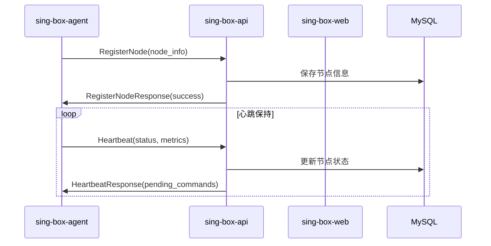
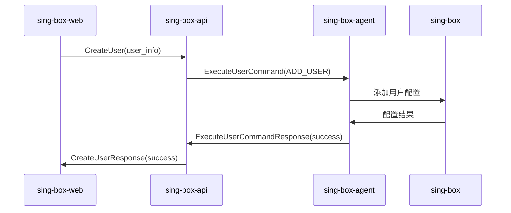
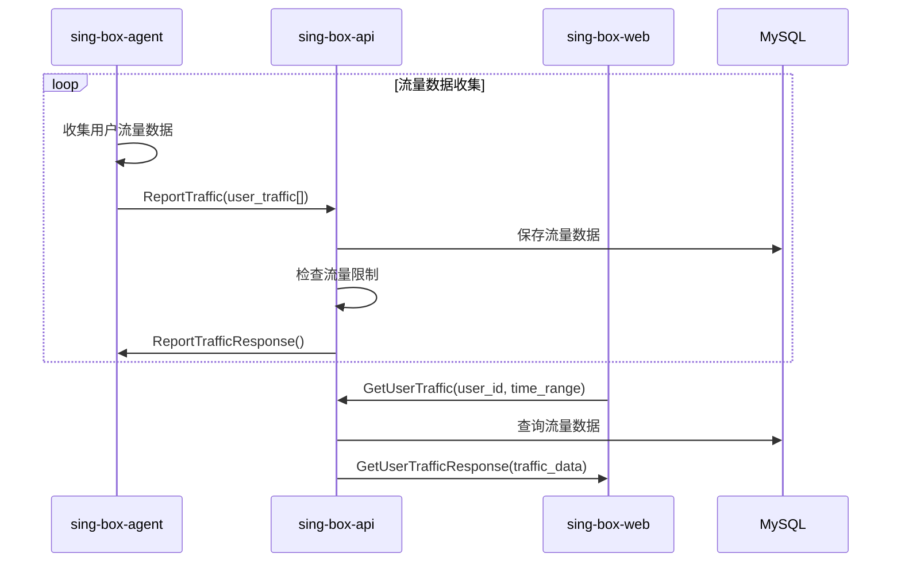
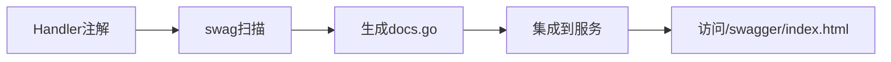
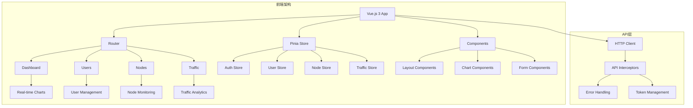
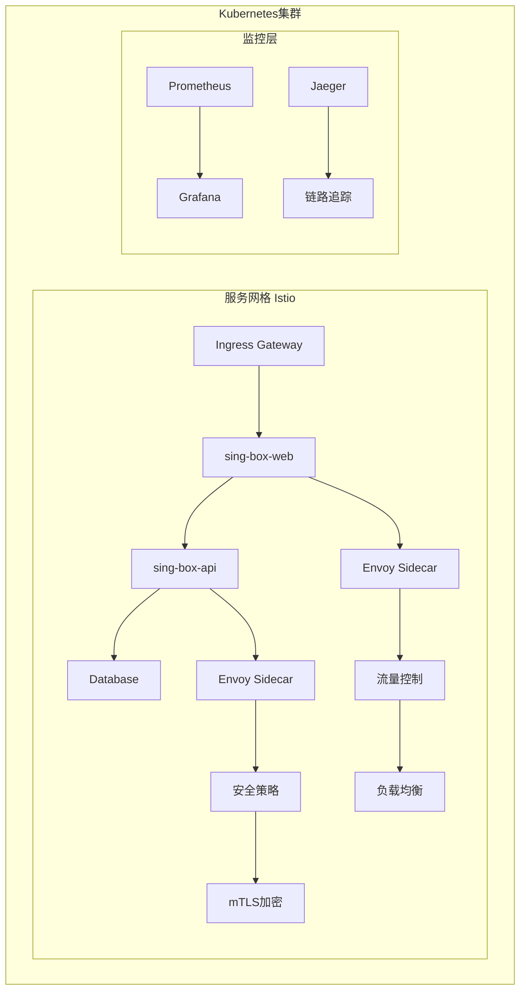
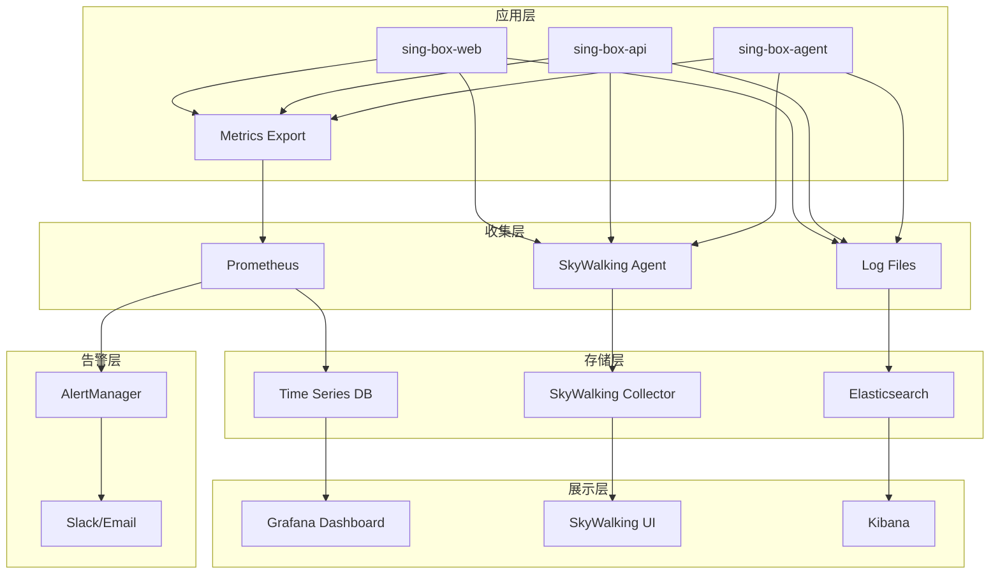
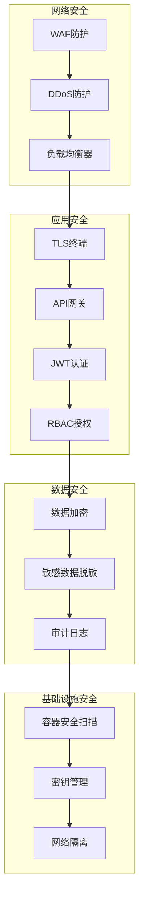
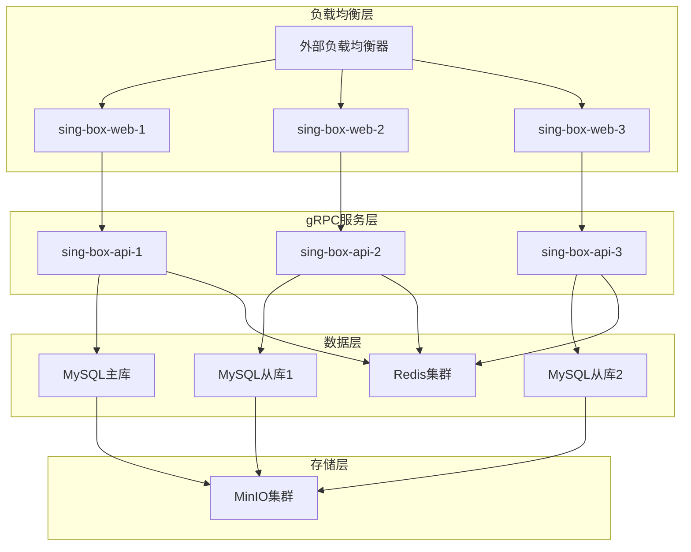

### 分布式 sing-box 管理平台架构设计

---

#### **一、核心目标**  
在 **1C1G 低配置节点** 环境下，实现 **轻量级、高可用** 的 sing-box 分布式管理平台，核心功能包括：节点配置管理、节点监控、用户流量与套餐管理、Clash API 数据集成。架构采用 **B/S（前端）+ gRPC（后端服务通信）** 模式，通过 **SkyWalking 统一无侵入集成** 实现全链路监控，日志使用 **Zap** 结构化输出，降低资源占用。

---

### **二、整体架构概览**  
```mermaid
graph TD
    subgraph 前端层
        Frontend[用户浏览器] -->|HTTP| WebServer[sing-box-web]
    end

    subgraph 应用层
        WebServer -->|gRPC| APIserver[sing-box-api]
        APIserver -->|gRPC| Agent1[sing-box-agent@节点1]
        APIserver -->|gRPC| Agent2[sing-box-agent@节点2]
        APIserver -->|gRPC| AgentN[sing-box-agent@节点N]
    end

    subgraph 数据层
        MySQL[用户/套餐/流量/日志/配置元数据] <--> WebServer
        MinIO[配置文件存储] <--> Agent1 & Agent2 & AgentN
    end

    subgraph 监控观测层
        SkyWalkingCollector[SkyWalking 采集器] <--|HTTP/gRPC| WebServer & APIserver & Agent1 & Agent2 & AgentN
        SkyWalkingUI[SkyWalking UI] <--|数据| SkyWalkingCollector
        Filebeat[日志收集] <--|文件| WebServer & APIserver & Agent1 & Agent2 & AgentN --> Elasticsearch[日志存储]
    end
```

---

### **三、项目结构设计**

#### **1. 整体项目布局（实际结构）**
```
sing-box-web/                     # 项目根目录
├── cmd/                          # 应用程序入口点
│   ├── sing-box-web/            # Web 服务器
│   │   ├── main.go
│   │   └── app/
│   │       ├── api.go           # 命令行应用程序入口
│   │       ├── options/         # 命令行选项
│   │       │   └── options.go
│   │       ├── router/          # 路由设置与中间件
│   │       │   ├── middleware.go
│   │       │   └── setup.go
│   │       ├── routes/          # 具体路由实现
│   │       │   └── auth/        # 认证相关路由
│   │       │       ├── handler.go
│   │       │       └── login.go
│   │       └── types/           # 统一API类型定义
│   │           ├── api/
│   │           │   └── v1/      # API v1版本类型
│   │           │       └── auth.go
│   │           └── common/      # 通用类型
│   │               ├── request.go
│   │               └── response.go
│   ├── sing-box-api/            # API 服务器（gRPC）
│   │   ├── main.go
│   │   └── app/                 # 与 web 结构类似
│   │       ├── api.go           # gRPC服务器命令行入口
│   │       ├── options/         # 命令行选项
│   │       ├── router/          # gRPC服务路由
│   │       ├── routes/          # gRPC服务实现
│   │       └── types/           # gRPC相关类型定义
│   └── sing-box-agent/          # 节点代理
│       ├── main.go
│       └── app/                 # Agent应用结构
│           ├── agent.go         # Agent命令行入口
│           ├── options/         # 命令行选项
│           └── services/        # Agent服务实现
├── pkg/                         # 可复用包
│   ├── config/                  # 配置管理（版本化）
│   │   ├── v1/                  # 配置版本 v1
│   │   │   ├── web.go
│   │   │   ├── api.go
│   │   │   └── agent.go
│   │   └── validation/          # 配置验证
│   ├── client/                  # 客户端管理
│   │   ├── manager.go           # 客户端管理器
│   │   └── grpc/                # gRPC 客户端
│   ├── server/                  # 服务端组件
│   │   ├── web/                 # Web 服务器
│   │   ├── api/                 # API 服务器
│   │   └── agent/               # Agent 服务器
│   ├── models/                  # 数据模型
│   ├── metrics/                 # 监控指标
│   ├── auth/                    # 认证授权
│   ├── util/                    # 工具函数
│   └── version/                 # 版本信息
├── api/                         # API 定义（Protobuf）
│   └── v1/
│       ├── agent.proto          # Agent gRPC服务定义
│       └── management.proto     # 管理 gRPC服务定义
├── ui/                          # 前端代码目录
├── scripts/                     # 脚本文件
├── doc/                         # 文档
│   └── 架构设计.md
├── Makefile
├── go.mod
├── go.sum
├── README.md
└── todo.md
```

#### **2. 核心模块设计**  

##### **A. sing-box-web（Web 后端服务）**  
- **功能**：用户认证（JWT）、权限控制（RBAC）、套餐与订阅管理、流量统计与状态管理、操作日志记录、通过gRPC调用 `sing-box-api`。  
- **技术栈**：Go + Gin（轻量级Web框架）+ GORM（ORM）+ Zap（结构化日志）+ SkyWalking Go Agent。
- **架构特点**：
  - `api.go`：Cobra命令行应用程序，通过 `_` 引入路由包实现自动路由注册
  - `router/setup.go`：Gin路由器初始化和中间件注册
  - `routes/`：具体业务路由实现，自动注册到路由器
  - `types/`：统一的API类型定义，版本化管理

```go
// cmd/sing-box-web/app/api.go
func NewWebCommand(ctx context.Context) *cobra.Command {
    opts := options.NewOptions()
    cmd := &cobra.Command{
        Use:  "sing-box-web",
        Long: `The sing-box-web provide web ui for sing-box management platform.`,
        RunE: func(_ *cobra.Command, _ []string) error {
            if err := opts.Validate(); err != nil {
                return err
            }
            return run(ctx, opts)
        },
    }
    // 添加命令行参数
    opts.AddFlags(cmd.Flags())
    return cmd
}
```

##### **B. sing-box-api（gRPC API 服务器）**  
- **功能**：节点管理、用户管理、流量统计、监控数据聚合、配置分发、批量操作。
- **技术栈**：Go + gRPC + Zap + SkyWalking Go Agent。  
- **gRPC服务**：
  - `ManagementService`：供sing-box-web调用的管理API
  - 提供节点管理、用户管理、流量统计、监控数据等功能

```go
// cmd/sing-box-api/app/api.go  
func NewAPICommand(ctx context.Context) *cobra.Command {
    opts := options.NewOptions()
    cmd := &cobra.Command{
        Use:  "sing-box-api",
        Long: `The sing-box-api provide gRPC API for sing-box-web and sing-box-agent.`,
        RunE: func(_ *cobra.Command, _ []string) error {
            if err := opts.Validate(); err != nil {
                return err
            }
            return run(ctx, opts)
        },
    }
    opts.AddFlags(cmd.Flags())
    return cmd
}
```

##### **C. sing-box-agent（节点代理）**  
- **功能**：节点注册、心跳保持、监控数据采集、流量数据上报、配置同步、用户管理命令执行。
- **技术栈**：Go（静态编译）+ gRPC Client + Cobra（CLI）+ Prometheus Client + Zap。
- **gRPC客户端**：连接到sing-box-api的AgentService

```go
// cmd/sing-box-agent/app/agent.go
func NewAgentCommand(ctx context.Context) *cobra.Command {
    opts := options.NewOptions()
    cmd := &cobra.Command{
        Use:  "sing-box-agent",
        Long: `The sing-box-agent runs on nodes to manage sing-box instances.`,
        RunE: func(_ *cobra.Command, _ []string) error {
            if err := opts.Validate(); err != nil {
                return err
            }
            return run(ctx, opts)
        },
    }
    opts.AddFlags(cmd.Flags())
    return cmd
}
```

---

### **四、gRPC 服务设计**

#### **1. Agent Service（agent.proto）**
```protobuf
service AgentService {
  // 节点生命周期管理
  rpc RegisterNode(RegisterNodeRequest) returns (RegisterNodeResponse);
  rpc Heartbeat(HeartbeatRequest) returns (HeartbeatResponse);
  
  // 数据上报
  rpc ReportMetrics(ReportMetricsRequest) returns (ReportMetricsResponse);
  rpc ReportTraffic(ReportTrafficRequest) returns (ReportTrafficResponse);
  
  // 配置与命令管理
  rpc UpdateConfig(UpdateConfigRequest) returns (UpdateConfigResponse);
  rpc ExecuteUserCommand(ExecuteUserCommandRequest) returns (ExecuteUserCommandResponse);
  rpc RestartSingBox(RestartSingBoxRequest) returns (RestartSingBoxResponse);
}
```

#### **2. Management Service（management.proto）**
```protobuf
service ManagementService {
  // 节点管理
  rpc ListNodes(ListNodesRequest) returns (ListNodesResponse);
  rpc GetNode(GetNodeRequest) returns (GetNodeResponse);
  rpc UpdateNodeConfig(UpdateNodeConfigRequest) returns (UpdateNodeConfigResponse);
  
  // 用户管理  
  rpc CreateUser(CreateUserRequest) returns (CreateUserResponse);
  rpc UpdateUser(UpdateUserRequest) returns (UpdateUserResponse);
  rpc ListUsers(ListUsersRequest) returns (ListUsersResponse);
  
  // 数据统计
  rpc GetUserTraffic(GetUserTrafficRequest) returns (GetUserTrafficResponse);
  rpc GetNodeMetrics(GetNodeMetricsRequest) returns (GetNodeMetricsResponse);
  rpc GetSystemOverview(Empty) returns (GetSystemOverviewResponse);
  
  // 批量操作
  rpc BatchUserOperation(BatchUserOperationRequest) returns (BatchUserOperationResponse);
}
```

---

### **五、服务通信流程**

#### **1. 节点注册与心跳流程**


#### **2. 用户管理流程**


#### **3. 流量数据上报流程**


---

### **六、数据模型设计**

#### **1. 核心数据结构**
```go
// 节点信息
type NodeInfo struct {
    NodeID       string    `json:"node_id"`
    NodeName     string    `json:"node_name"`
    NodeIP       string    `json:"node_ip"`
    Status       string    `json:"status"`        // online, offline, error
    Version      string    `json:"version"`
    LastSeen     time.Time `json:"last_seen"`
    Capability   NodeCapability `json:"capability"`
    UserCount    int32     `json:"user_count"`
    ConfigVersion string   `json:"config_version"`
}

// 用户信息
type UserInfo struct {
    UserID      string    `json:"user_id"`
    Username    string    `json:"username"`
    Email       string    `json:"email"`
    Status      string    `json:"status"`        // active, suspended, expired
    PlanID      int64     `json:"plan_id"`
    AllowedNodes []string `json:"allowed_nodes"`
    CreatedAt   time.Time `json:"created_at"`
    ExpiresAt   time.Time `json:"expires_at"`
    TrafficSummary TrafficSummary `json:"traffic_summary"`
}

// 流量摘要
type TrafficSummary struct {
    UsedBytes     int64   `json:"used_bytes"`
    TotalBytes    int64   `json:"total_bytes"`
    UsagePercent  float64 `json:"usage_percent"`
    DailyUsage    int64   `json:"daily_usage"`
}
```

---

### **七、配置管理设计**

#### **1. 版本化配置结构**
```go
// pkg/config/v1/web.go
type WebConfig struct {
    APIVersion string `json:"apiVersion"`
    Kind       string `json:"kind"`
    
    // 服务配置
    BindAddr string `json:"bindAddr"`
    BindPort int    `json:"bindPort"`
    
    // 数据库配置
    Database DatabaseConfig `json:"database"`
    
    // API 服务器配置
    APIServer APIServerConfig `json:"apiServer"`
    
    // 日志配置
    Log LogConfig `json:"log"`
}

// pkg/config/v1/api.go
type APIConfig struct {
    APIVersion string `json:"apiVersion"`
    Kind       string `json:"kind"`
    
    // gRPC 服务配置
    GRPCBindAddr string `json:"grpcBindAddr"`
    GRPCBindPort int    `json:"grpcBindPort"`
    
    // 数据库配置
    Database DatabaseConfig `json:"database"`
    
    // 日志配置
    Log LogConfig `json:"log"`
}

// pkg/config/v1/agent.go
type AgentConfig struct {
    APIVersion string `json:"apiVersion"`
    Kind       string `json:"kind"`
    
    // 节点信息
    NodeID   string `json:"nodeId"`
    NodeName string `json:"nodeName"`
    
    // API 服务器连接
    APIServer APIServerConnection `json:"apiServer"`
    
    // sing-box 配置
    SingBox SingBoxConfig `json:"singBox"`
    
    // 监控配置
    Monitor MonitorConfig `json:"monitor"`
    
    // 日志配置
    Log LogConfig `json:"log"`
}
```

---

### **八、监控与可观测性**

#### **1. SkyWalking 集成**
- **无侵入式集成**：通过 SkyWalking Go Agent 在编译时集成
- **全链路追踪**：HTTP请求 -> gRPC调用 -> 数据库操作
- **服务拓扑**：自动发现服务依赖关系
- **性能监控**：接口响应时间、错误率、吞吐量

#### **2. 指标监控**
```go
// pkg/metrics/metrics.go
var (
    // HTTP 指标
    httpRequestsTotal = prometheus.NewCounterVec(
        prometheus.CounterOpts{
            Name: "sing_box_web_http_requests_total",
            Help: "Total number of HTTP requests",
        },
        []string{"method", "path", "status"},
    )
    
    // gRPC 指标
    grpcRequestsTotal = prometheus.NewCounterVec(
        prometheus.CounterOpts{
            Name: "sing_box_api_grpc_requests_total", 
            Help: "Total number of gRPC requests",
        },
        []string{"service", "method", "status"},
    )
    
    // 节点指标
    nodeStatus = prometheus.NewGaugeVec(
        prometheus.GaugeOpts{
            Name: "sing_box_node_status",
            Help: "Node status (1=online, 0=offline)",
        },
        []string{"node_id", "node_name"},
    )
    
    // 用户流量指标
    userTrafficBytes = prometheus.NewCounterVec(
        prometheus.CounterOpts{
            Name: "sing_box_user_traffic_bytes_total",
            Help: "Total user traffic in bytes",
        },
        []string{"user_id", "direction", "node_id"},
    )
)
```

---

### **九、部署架构**

#### **1. 单节点部署**
```yaml
# 开发/测试环境
services:
  - sing-box-web:8080    # Web服务
  - sing-box-api:8001    # API服务  
  - mysql:3306           # 数据库
  - minio:9000          # 对象存储
```

#### **2. 分布式部署**
```yaml
# 生产环境
control-plane:
  - sing-box-web (HA)    # Web服务高可用
  - sing-box-api (HA)    # API服务高可用
  - mysql-cluster        # 数据库集群
  - minio-cluster        # 存储集群
  
edge-nodes:
  - sing-box-agent       # 边缘节点代理
  - sing-box             # sing-box实例
```

---

### **十、技术选型说明**

1. **Web框架**：Gin - 轻量级、高性能HTTP框架
2. **gRPC**：Google gRPC - 高性能、跨语言RPC框架
3. **ORM**：GORM - Go语言ORM，支持多种数据库
4. **日志**：Zap - 高性能结构化日志库
5. **监控**：SkyWalking - 分布式追踪和监控平台
6. **CLI**：Cobra - 强大的CLI库，支持子命令和参数验证
7. **配置**：支持YAML/JSON格式，版本化管理
8. **数据库**：MySQL - 成熟稳定的关系型数据库
9. **存储**：MinIO - 高性能对象存储，S3兼容

---

### **十、API文档自动生成架构**

#### **1. 技术方案**
```go
// 集成gin-swagger实现API文档自动生成
import (
    swaggerFiles "github.com/swaggo/files"
    ginSwagger "github.com/swaggo/gin-swagger"
    _ "sing-box-web/docs" // 自动生成的文档包
)

// main.go中的swagger配置
// @title           Sing-Box Management Platform API
// @version         1.0
// @description     分布式sing-box管理平台API
// @host            localhost:8080
// @BasePath        /api/v1
// @securityDefinitions.apikey BearerAuth
// @in header
// @name Authorization
```

#### **2. 文档生成流程**


#### **3. API注解示例**
```go
// Login godoc
// @Summary      用户登录
// @Description  验证用户凭据并返回JWT令牌
// @Tags         Authentication
// @Accept       json
// @Produce      json
// @Param        request body LoginRequest true "登录凭据"
// @Success      200 {object} LoginResponse "登录成功"
// @Failure      401 {object} map[string]interface{} "认证失败"
// @Router       /api/v1/auth/login [post]
func (h *Handler) Login(c *gin.Context) { ... }
```

---

### **十一、前端架构设计**

#### **1. 技术栈架构**
```
Frontend Stack:
├── Vue.js 3                    # 响应式前端框架
│   ├── Composition API         # 组合式API
│   ├── TypeScript              # 类型安全
│   └── Single File Components  # 单文件组件
├── UI Framework
│   ├── Element Plus            # UI组件库
│   ├── Custom Components       # 自定义组件
│   └── Chart.js/ECharts       # 数据可视化
├── State Management
│   ├── Pinia                   # 状态管理
│   ├── Composables             # 可组合函数
│   └── Persistent Storage      # 持久化存储
├── Routing & Navigation
│   ├── Vue Router 4            # 路由管理
│   ├── Route Guards            # 路由守卫
│   └── Lazy Loading            # 懒加载
└── Build & Development
    ├── Vite                    # 构建工具
    ├── TypeScript              # 类型检查
    └── ESLint + Prettier       # 代码规范
```

#### **2. 前端架构图**


#### **3. 实时数据架构**
```go
// WebSocket连接管理
type WebSocketManager struct {
    connections map[string]*websocket.Conn
    broadcast   chan []byte
    register    chan *websocket.Conn
    unregister  chan *websocket.Conn
}

// 实时数据推送
func (w *WebSocketManager) PushMetrics(metrics *SystemMetrics) {
    data, _ := json.Marshal(metrics)
    w.broadcast <- data
}
```

---

### **十二、容器化和部署架构**

#### **1. Docker容器化架构**
```dockerfile
# 多阶段构建示例
FROM golang:1.21-alpine AS builder
WORKDIR /app
COPY . .
RUN go mod download
RUN CGO_ENABLED=0 GOOS=linux go build -o sing-box-web ./cmd/sing-box-web

FROM alpine:latest
RUN apk --no-cache add ca-certificates
WORKDIR /root/
COPY --from=builder /app/sing-box-web .
COPY --from=builder /app/configs ./configs
CMD ["./sing-box-web", "--config", "configs/web.yaml"]
```

#### **2. Kubernetes部署架构**
```yaml
# Kubernetes架构示例
apiVersion: apps/v1
kind: Deployment
metadata:
  name: sing-box-web
spec:
  replicas: 3
  selector:
    matchLabels:
      app: sing-box-web
  template:
    spec:
      containers:
      - name: sing-box-web
        image: sing-box-web:latest
        ports:
        - containerPort: 8080
        env:
        - name: DATABASE_HOST
          valueFrom:
            secretKeyRef:
              name: database-secrets
              key: host
```

#### **3. 服务网格架构**


---

### **十三、完整监控和可观测性架构**

#### **1. 监控体系架构**


#### **2. 监控指标体系**
```go
// 核心监控指标
var MonitoringMetrics = struct {
    // 系统指标
    SystemCPU     prometheus.Gauge
    SystemMemory  prometheus.Gauge
    SystemDisk    prometheus.Gauge
    
    // 业务指标
    ActiveUsers   prometheus.Gauge
    OnlineNodes   prometheus.Gauge
    TotalTraffic  prometheus.Counter
    
    // 性能指标
    APILatency    prometheus.Histogram
    DBConnections prometheus.Gauge
    ErrorRate     prometheus.Counter
    
    // 自定义告警
    UserQuotaAlert prometheus.Gauge
    NodeDownAlert  prometheus.Gauge
}{
    SystemCPU: prometheus.NewGauge(prometheus.GaugeOpts{
        Name: "system_cpu_usage_percent",
        Help: "Current CPU usage percentage",
    }),
    // ... 其他指标定义
}
```

#### **3. 告警规则配置**
```yaml
# Prometheus告警规则
groups:
- name: sing-box-alerts
  rules:
  - alert: HighErrorRate
    expr: rate(http_requests_total{status=~"5.."}[5m]) > 0.1
    for: 5m
    labels:
      severity: critical
    annotations:
      summary: "High error rate detected"
      
  - alert: NodeDown
    expr: up{job="sing-box-agent"} == 0
    for: 1m
    labels:
      severity: warning
    annotations:
      summary: "Node {{ $labels.instance }} is down"
```

---

### **十四、安全架构和最佳实践**

#### **1. 安全层级架构**


#### **2. 安全配置示例**
```go
// JWT安全配置
type JWTConfig struct {
    Secret           string        `json:"secret"`
    Issuer          string        `json:"issuer"`
    Expiration      time.Duration `json:"expiration"`
    RefreshExpiration time.Duration `json:"refresh_expiration"`
    SigningMethod   string        `json:"signing_method"`
}

// 敏感数据加密
func (s *Service) EncryptSensitiveData(data string) (string, error) {
    block, err := aes.NewCipher(s.encryptionKey)
    if err != nil {
        return "", err
    }
    // AES-GCM加密实现
    // ...
}
```

---

### **十五、性能优化和扩展性架构**

#### **1. 性能优化策略**
```go
// 数据库连接池优化
type DatabaseConfig struct {
    MaxIdleConns    int           `json:"max_idle_conns"`
    MaxOpenConns    int           `json:"max_open_conns"`
    ConnMaxLifetime time.Duration `json:"conn_max_lifetime"`
    ConnMaxIdleTime time.Duration `json:"conn_max_idle_time"`
}

// Redis缓存层
type CacheManager struct {
    client  *redis.Client
    ttl     time.Duration
    prefix  string
}

// 分页查询优化
func (r *Repository) GetUsersWithPagination(offset, limit int, filters UserFilter) (*PaginatedUsers, error) {
    // 使用游标分页而非偏移分页
    // 添加适当的索引
    // 缓存热点数据
}
```

#### **2. 水平扩展架构**


---

### **十六、总结与发展规划**

#### **1. 架构优势**

本架构设计采用了现代微服务架构模式，具有以下特点：

1. **模块化设计**：清晰的项目结构，职责分离
2. **统一API设计**：通过types包统一API类型定义  
3. **自动路由注册**：通过包引入实现路由自动注册
4. **gRPC通信**：高性能的服务间通信
5. **版本化配置**：支持配置版本管理和验证
6. **全链路监控**：SkyWalking无侵入集成
7. **自动化文档**：Swagger API文档自动生成
8. **容器化部署**：Docker + Kubernetes生产就绪
9. **完整监控**：Prometheus + Grafana + 告警系统
10. **安全加固**：多层安全防护和最佳实践

#### **2. 技术发展路径**

**短期目标（1-3个月）**：
- 完成前端UI开发
- 完善监控和告警系统
- 生产环境部署和优化

**中期目标（3-6个月）**：
- 实现多租户支持
- 添加计费和订阅系统
- 支持插件化扩展

**长期目标（6-12个月）**：
- 云原生架构升级
- 多云部署支持
- 边缘计算集成

这种架构确保了系统的**可维护性**、**可扩展性**和**生产可用性**，同时在低配置环境下保持良好的性能表现。通过模块化设计和微服务架构，系统可以灵活应对不同规模的部署需求，从单节点部署到大规模分布式集群。