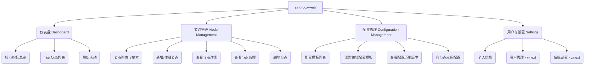
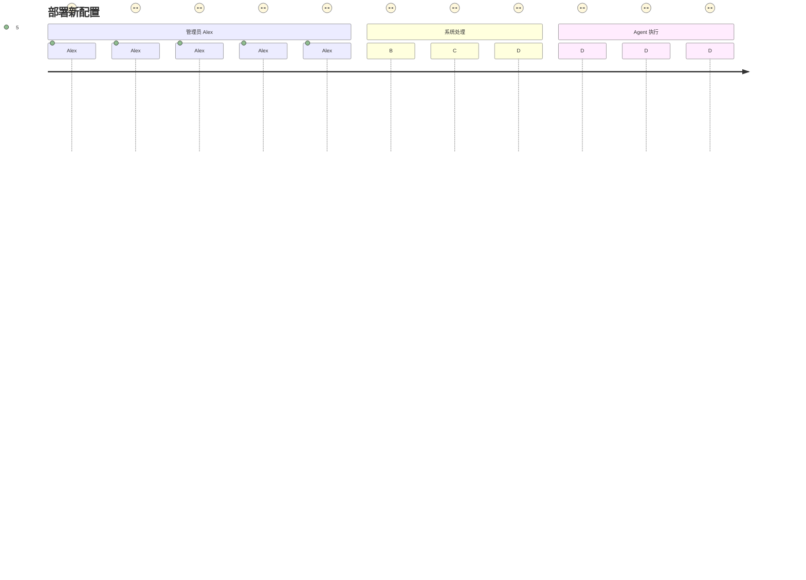

# 产品需求文档 (PRD) - sing-box-web

## 1. 文档信息

| 字段 | 内容 |
| :--- | :--- |
| **产品名称** | sing-box-web：分布式 sing-box 管理平台 |
| **文档版本** | v1.0 |
| **创建日期** | 2023-10-27 |
| **作者** | 产品经理 (AI) |
| **状态** | 初稿 |

### 1.1 版本历史

| 版本 | 日期 | 作者 | 修订说明 |
| :--- | :--- | :--- | :--- |
| v1.0 | 2023-10-27 | 产品经理 (AI) | 初始版本创建，基于用户核心需求和技术架构文档 |

### 1.2 文档目的

本文档旨在明确 `sing-box-web` 产品的功能与非功能需求，作为产品设计、开发、测试和上线等后续工作的核心指导依据。它旨在将用户的初期构想转化为清晰、可执行的产品计划，统一团队对产品目标的认知。

### 1.3 相关文档引用

- `docs/架构设计.md`: 描述了产品的整体技术架构，包括 C/S 和 B/S 混合模式。
- `docs/工程化设计.md`: 描述了项目的代码结构、命令行工具、API 设计和构建流程。

---

## 2. 产品概述

### 2.1 产品名称与定位

- **产品名称**: `sing-box-web`
- **产品定位**: 一个专业、高效的分布式 `sing-box` 实例统一管理与监控平台。

### 2.2 产品愿景与使命

- **愿景**: 成为 `sing-box` 生态中最受欢迎、最强大的可视化管理工具，让大规模 `sing-box` 部署的管理变得前所未有的简单。
- **使命**: 通过提供集中化的配置管理和实时的状态监控，极大提升运维效率，降低手动操作风险，保障服务稳定性。

### 2.3 价值主张与独特卖点 (USP)

- **集中化控制台**: 通过一个 Web 界面，管理和监控所有分布式节点，提供“上帝视角”。
- **一键式配置分发**: 安全、可靠地将配置变更应用到单个、部分或全部节点，实现敏捷部署。
- **实时性能监控**: 集成节点级的核心资源监控（CPU、内存、磁盘、网络），快速定位和诊断问题。
- **轻量级与安全**: 基于 Agent-Server 模式，采用高效安全的 gRPC 协议通信，对节点性能影响极小。

### 2.4 目标平台列表

- **管理端 (Web UI)**: 平台无关，支持所有主流现代桌面浏览器（如 Chrome, Firefox, Safari, Edge）。
- **服务端 (`sing-box-api`, `sing-box-web`)**:
    - **主要**: Linux (任意发行版), Docker 容器
    - **次要**: Windows Server
- **节点端 (`sing-box-agent`)**:
    - **主要**: 所有主流 Linux 发行版 (Debian, CentOS, Ubuntu, etc.)
    - **次要**: macOS, Windows (任何可以运行 `sing-box` 的地方)

### 2.5 产品核心假设

1.  用户正面临管理多个（≥2）`sing-box` 实例的挑战。
2.  用户倾向于使用 GUI 来简化重复性的命令行操作。
3.  用户需要一个集中的视图来监控所有节点的健康状况。
4.  用户具备在目标节点上安装和运行一个 Agent 程序的基础运维能力。

### 2.6 商业模式概述

本项目初期定位为一款强大的开源工具，免费提供给社区使用。未来可探索提供增值服务的商业模式，例如：
- **企业版**: 提供更高级的功能，如团队协作、角色权限管理 (RBAC)、操作审计日志、SAML/LDAP 集成等。
- **云服务**: 提供 SaaS 版本，用户无需自行部署和维护管理平台。

---

## 3. 用户研究

### 3.1 目标用户画像

- **画像 1: DevOps 工程师 - Alex**
    - **人口统计**: 28岁，男性，在一家中型科技公司工作。
    - **行为习惯**: 熟练使用 Docker, K8s, Ansible 等自动化工具。每天花费大量时间在终端和各种 Web 控制台之间切换。追求效率，厌恶重复和手动易错的工作。
    - **核心需求与痛点**:
        - **痛点**: 公司有数十个 `sing-box` 节点分布在不同云厂商的服务器上。每次修改路由规则或更换出口节点，都需要手动 SSH 登录一台台机器修改 JSON 配置并重启服务，过程繁琐、耗时且极易出错。
        - **痛点**: 无法直观了解每个节点的负载情况，当用户反馈网络慢时，排查问题像“盲人摸象”。
        - **需求**: 希望有一个“驾驶舱”，能看到所有节点状态，并能批量更新配置。
    - **动机与目标**: 寻找一个能将他从 `sing-box` 的重复运维工作中解放出来的工具，让他可以专注于更高价值的架构优化工作。

### 3.2 用户场景分析

- **核心场景 1: 批量更新配置**
    - **场景描述**: Alex 需要为一个新业务添加一条全局路由规则。他登录 `sing-box-web`，进入配置管理界面，从一个基础模板创建了一个新版本的配置。在配置编辑器中，他加入了新的路由规则并保存。随后，他通过标签筛选出所有“生产环境”的节点，点击“应用配置”，在弹出的确认框中输入“新增业务 A 路由”作为变更说明后，点击确认。几秒钟后，他看到所有目标节点的状态都显示为“配置已同步”。
- **核心场景 2: 故障排查**
    - **场景描述**: Alex 收到监控系统告警，某个服务的延迟飙高。他打开 `sing-box-web` 的仪表盘，通过排序发现一个节点的 CPU 使用率和网络出口流量异常。他点击该节点进入详情页，查看历史监控数据图表，确认了流量是在 10 分钟前开始突增的。他立刻在该节点上应用了一个限制性的备用配置，服务延迟恢复正常。
- **边缘场景 3: 新增节点**
    - **场景描述**: 公司新增了一台服务器。Alex 在新服务器上通过一行命令安装并启动了 `sing-box-agent`。几秒后，新节点自动出现在 `sing-box-web` 的节点列表中，状态为“待纳管”。Alex 为其添加了标签，并应用了标准配置，节点正式投入使用。

---

## 4. 市场与竞品分析

### 4.1 市场概览
目前 `sing-box` 的管理主要依赖手动操作或通用的自动化工具，缺乏专门为此设计的、集管理与监控于一体的可视化平台。这是一个利基市场，但对于重度 `sing-box` 用户来说，痛点明确，存在强需求。

### 4.2 竞争格局分析

| 竞品/方案 | 优势 | 劣势 |
| :--- | :--- | :--- |
| **直接竞争**: (暂无成熟产品) | - | - |
| **间接竞争: 手动 SSH + 脚本** | 灵活，无额外依赖 | 效率低下，易出错，无实时状态反馈，无审计 |
| **间接竞争: Ansible/SaltStack** | 强大，可实现批量配置 | 学习曲线陡峭，为重量级工具，无专用 UI，无实时监控 |
| **间接竞争: 各类 Dashboard UI** | UI 直观 | 通常只支持单个实例，不支持分布式管理和监控 |

### 4.3 市场差异化策略
`sing-box-web` 的核心差异化在于 **专注** 和 **整合**。我们不寻求成为一个通用的运维平台，而是要成为 `sing-box` 管理领域的最佳解决方案，将 **分布式配置管理** 和 **节点实时监控** 这两大核心功能无缝整合在一个对用户友好的产品中。

---

## 5. 产品功能需求

### 5.1 功能架构图

### 5.2 核心功能详述

#### 5.2.1 节点管理 (P0)
- **功能描述 (用户故事)**: 作为一个管理员，我想要查看所有已连接的节点列表，并能清晰地看到它们的基本信息和实时状态（在线/离线），以便我能快速掌握整个集群的健康状况。
- **功能逻辑与规则**:
    1. Agent 启动后，携带节点 ID 连接 `sing-box-api` 的 gRPC 服务并进行注册。
    2. 注册成功后，Agent 定期（如 30s）发送心跳。
    3. API 服务器记录每个节点的最后心跳时间。若超过设定阈值（如 90s）未收到心跳，则将节点状态置为“离线”。
    4. Web UI 通过轮询或 WebSocket 从 API 获取节点列表并展示。
- **验收标准**:
    1. 新 Agent 启动后，在 10 秒内出现在 Web UI 的节点列表中，状态为“在线”。
    2. Agent 停止后，在 90 秒内，其在 Web UI 上的状态应变为“离线”。
    3. 节点列表应至少展示：节点名称、节点 IP、状态、Agent 版本、系统类型、标签。

#### 5.2.2 配置管理与分发 (P0)
- **功能描述 (用户故事)**: 作为一个管理员，我想要能够创建、编辑和保存多个 `sing-box` 的配置版本，并能选择一个或多个节点来应用指定的配置，从而实现集中化的配置管理。
- **功能逻辑与规则**:
    1. Web UI 提供一个带语法高亮的 JSON 编辑器用于编辑 `sing-box` 配置。
    2. 配置以“配置模板”的形式保存，支持版本管理。
    3. 当用户选择向节点应用配置时，Web UI 调用 API，API 通过 gRPC 向对应的 Agent 发送“配置更新”指令，指令中包含完整的 JSON 配置内容。
    4. Agent 接收到指令后，备份旧配置文件，写入新配置文件，然后执行 `sing-box check` 命令验证配置。
    5. 验证通过后，Agent 向 `sing-box` 进程发送 `SIGHUP` 信号以热重载配置（或执行 `restart` 命令）。
    6. Agent 将执行结果（成功/失败及错误信息）通过 gRPC 回传给 API 服务器。
- **验收标准**:
    1. 在 Web UI 中创建的配置模板被成功保存到数据库。
    2. 应用配置后，目标节点的 `sing-box` 配置文件内容应与模板一致。
    3. `sing-box` 服务在配置更新后应仍在运行，且应用了新配置。
    4. Web UI 能正确显示配置应用成功或失败的状态。

#### 5.2.3 节点监控 (P0)
- **功能描述 (用户故事)**: 作为一个管理员，我想要在节点详情页面看到该节点近期的 CPU、内存、磁盘和网络 IO 的历史数据图表，以便我能分析资源使用趋势和排查性能问题。
- **功能逻辑与规则**:
    1. Agent 定期（如 10s）采集其所在节点的系统资源使用情况。
    2. 采集到的监控数据通过 gRPC 流式上报给 API 服务器。
    3. API 服务器将数据存入时序数据库或缓存中。
    4. Web UI 请求指定时间范围内的监控数据，并使用图表库（如 ECharts）进行渲染。
- **验收标准**:
    1. 节点详情页能正确展示 CPU 使用率、内存使用率、磁盘使用率、网络上/下行速率四个核心指标的曲线图。
    2. 图表数据应能反映最近1小时、6小时、24小时等不同时间范围。
    3. 图表数据刷新间隔应不高于 15 秒。

---

## 6. 用户流程与交互设计指导

### 6.1 核心用户旅程地图

### 6.2 对设计师 (UI/UX) 的指导
- **仪表盘**: 信息密度要高，但不能混乱。核心指标（在线节点数/总数，配置异常节点数）应最为突出。
- **编辑器**: 配置编辑器必须提供 JSON 语法高亮和格式化功能。
- **一致性**: 保持界面元素和操作逻辑的一致性，例如，所有列表页都应支持搜索和筛选。
- **反馈**: 任何耗时操作（如应用配置）都必须有明确的加载状态和最终的结果反馈（成功、失败、警告）。

---

## 7. 非功能需求

| 类别 | 需求描述 |
| :--- | :--- |
| **性能** | - Agent 对宿主机的 CPU/内存资源占用率应低于 5%。 - Web UI 页面加载时间 < 2s。 - 99% 的 API 请求响应时间 < 200ms。 - 单个 Manager 应能支持至少 500 个 Agent 并发连接。 |
| **安全** | - Manager 与 Agent 之间的 gRPC 通信必须默认启用 TLS 加密。 - Agent 连接 Manager 需要提供预设的 Token 进行认证。 - Web UI 的用户登录需要密码加密存储和防暴力破解机制。 - Web 接口应防御常见的安全漏洞（XSS, CSRF, SQL注入）。 |
| **可用性** | - Agent 必须有守护进程机制，在意外退出后能自动重启。 - Agent 必须支持断线重连，并在重连后立即上报最新状态。 - 核心服务（API, Web）应达到 99.9% 的可用性。 |
| **数据统计**| 需要埋点跟踪的关键事件：用户登录、节点增删、配置分发、配置分发成功/失败。 |

---

## 8. 技术架构考量

- **技术栈**: 遵循 `工程化设计.md` 中定义的技术选型，后端 Go，前端 Vue/React，gRPC 通信。
- **数据存储**:
    - **结构化数据** (节点信息, 配置模板): 使用 PostgreSQL 或 SQLite。
    - **监控数据**: 初期可使用 Redis 缓存，长期考虑引入时序数据库如 InfluxDB 或 Prometheus。
- **集成需求**: `sing-box-agent` 需要有权限读取 `sing-box` 的运行状态（PID文件）并向其发送信号（`SIGHUP`）。

---

## 9. 验收标准汇总

| 功能模块 | 关键验收标准 | 优先级 |
| :--- | :--- | :--- |
| **节点管理** | 节点能自动注册，状态能实时更新。 | P0 |
| **配置管理** | 能创建、编辑、保存、版本化配置，并能成功分发到节点。 | P0 |
| **节点监控** | 能实时查看四个核心系统指标的历史图表。 | P0 |
| **安全** | 通信加密，接口有认证。 | P0 |

---

## 10. 产品成功指标

### 10.1 关键绩效指标 (KPIs)

- **MAU (月活跃用户数)**: 衡量产品的用户基数和粘性。
- **Node Count (纳管节点总数)**: 反映产品的覆盖广度和用户的信任度。
- **Deployment Frequency (配置分发频率)**: 体现产品的核心价值被使用的频繁程度。
- **Adoption Rate (新功能采用率)**: 衡量新功能是否满足用户需求。

### 10.2 北极星指标

- **WACN (Weekly Active Connected Nodes - 周活跃连接节点数)**
- **选择依据**: 这个指标完美结合了产品的 **广度** (有多少节点安装了Agent)，**深度** (有多少用户每周都在活跃使用)，以及 **核心价值** (节点保持连接在线，意味着正在被管理)。一个持续增长的 WACN 指标，表明我们的产品正在为越来越多的用户，在越来越大的规模上，持续不断地创造价值。

### 10.3 指标监测计划

- 使用内建的数据统计功能，或集成第三方分析工具（如 PostHog, Mixpanel）。
- 每周生成并审视核心指标报告。
- 每个季度根据数据回顾产品路线图的优先级。 