# 用户故事地图 (User Story Map) - sing-box-web

## 1. 用户故事地图概述

本用户故事地图旨在通过可视化方式，将 `sing-box-web` 的功能需求分解为从用户视角出发的活动、任务和故事。它将指导我们的迭代规划，确保我们始终聚焦于为用户创造核心价值。

- **核心用户**: Alex, DevOps 工程师。
- **目标**: 简化分布式 `sing-box` 的管理和监控。

---

## 2. 用户故事地图

```mermaid
graph TD
    subgraph "Release 1: MVP - 核心功能"
        direction LR
        subgraph " "
            direction TB
            C1("<b>(Task)</b><br>查看节点列表")
            C1_S1("<b>(Story)</b><br>作为管理员, 我能看到所有注册节点的列表及其在线/离线状态")
            C1_S2("<b>(Story)</b><br>作为管理员, 我能看到节点的 IP, Agent 版本和 OS 信息")
        end
        
        subgraph " "
            direction TB
            D1("<b>(Task)</b><br>查看节点详情与监控")
            D1_S1("<b>(Story)</b><br>作为管理员, 我能点击节点进入详情页")
            D1_S2("<b>(Story)</b><br>作为管理员, 我能查看节点实时的 CPU/内存/磁盘/网络监控图表")
        end

        subgraph " "
            direction TB
            E1("<b>(Task)</b><br>管理配置模板")
            E1_S1("<b>(Story)</b><br>作为管理员, 我能创建和保存一个 sing-box JSON 配置作为模板")
            E1_S2("<b>(Story)</b><br>作为管理员, 我能编辑和更新已保存的配置模板")
            E1_S3("<b>(Story)</b><br>作为管理员, 我能看到所有配置模板的列表")
        end
        
        subgraph " "
            direction TB
            F1("<b>(Task)</b><br>分发配置")
            F1_S1("<b>(Story)</b><br>作为管理员, 我能选择一个或多个节点")
            F1_S2("<b>(Story)</b><br>作为管理员, 我能从模板列表中选择一个配置应用到选定节点")
            F1_S3("<b>(Story)</b><br>作为管理员, 我能看到配置分发成功或失败的结果")
        end
    end
    
    subgraph "Release 2: v2.0 - 易用性与效率提升"
        direction LR
        subgraph " "
            direction TB
            C2("<b>(Task)</b><br>搜索与标记节点")
            C2_S1("<b>(Story)</b><br>作为管理员, 我能为节点添加/删除自定义标签 (如 'prod', 'dev')")
            C2_S2("<b>(Story)</b><br>作为管理员, 我能通过名称, IP 或标签快速搜索和筛选节点")
        end
        
        subgraph " "
            direction TB
            D2("<b>(Task)</b><br>查看仪表盘")
            D2_S1("<b>(Story)</b><br>作为管理员, 我能在仪表盘看到集群核心指标 (如在线/总节点数)")
            D2_S2("<b>(Story)</b><br>作为管理员, 我能在仪表盘看到最近的配置变更活动")
        end
        
        subgraph " "
            direction TB
            E2("<b>(Task)</b><br>配置版本管理")
            E2_S1("<b>(Story)</b><br>作为管理员, 我每次保存配置都会创建一个新的版本")
            E2_S2("<b>(Story)</b><br>作为管理员, 我能查看一个配置模板的历史版本并进行比较")
            E2_S3("<b>(Story)</b><br>作为管理员, 我能将节点回滚到某个历史配置版本")
        end

        subgraph " "
            direction TB
            F2("<b>(Task)</b><br>基础账户管理")
            F2_S1("<b>(Story)</b><br>作为用户, 我可以注册账号和登录")
            F2_S2("<b>(Story)</b><br>作为用户, 我可以修改自己的密码")
        end
    end
    
    subgraph "Future Releases: 企业级功能"
        direction LR
        subgraph " "
            direction TB
            C3("<b>(Task)</b><br>节点分组")
        end
        subgraph " "
            direction TB
            D3("<b>(Task)</b><br>告警与通知")
        end
        subgraph " "
            direction TB
            E3("<b>(Task)</b><br>操作审计日志")
        end
        subgraph " "
            direction TB
            F3("<b>(Task)</b><br>团队与权限管理 (RBAC)")
        end
    end

    subgraph "User Activities (用户活动)"
        direction LR
        B("<b>节点管理</b>") --> C1 & C2 & C3
        B --> D1 & D2 & D3
        B("<b>配置管理</b>") --> E1 & E2 & E3
        B("<b>系统管理</b>") --> F1 & F2 & F3
    end
    
    style B fill:#1E90FF,stroke:#333,stroke-width:2px,color:#fff
    style C1 fill:#f9f,stroke:#333,stroke-width:2px
    style C2 fill:#f9f,stroke:#333,stroke-width:2px
    style C3 fill:#f9f,stroke:#333,stroke-width:2px
    style D1 fill:#f9f,stroke:#333,stroke-width:2px
    style D2 fill:#f9f,stroke:#333,stroke-width:2px
    style D3 fill:#f9f,stroke:#333,stroke-width:2px
    style E1 fill:#f9f,stroke:#333,stroke-width:2px
    style E2 fill:#f9f,stroke:#333,stroke-width:2px
    style E3 fill:#f9f,stroke:#333,stroke-width:2px
    style F1 fill:#f9f,stroke:#333,stroke-width:2px
    style F2 fill:#f9f,stroke:#333,stroke-width:2px
    style F3 fill:#f9f,stroke:#333,stroke-width:2px
```

---

## 3. 版本发布规划 (Release Plan)

### Release 1: MVP - 最小可行产品
**目标**: 验证产品的核心价值，提供最基础的分布式 `sing-box` 配置管理和节点监控能力。
- **用户活动**: 节点管理, 配置管理
- **核心任务**:
  - 查看所有节点及其在线状态。
  - 查看单个节点的实时性能指标。
  - 创建、编辑、保存配置模板。
  - 向一个或多个节点应用配置并查看结果。

### Release 2: v2.0 - 易用性与效率提升
**目标**: 在 MVP 的基础上，优化大规模节点管理的效率，提供宏观的系统视图，并完善基础用户体系。
- **用户活动**: 节点管理, 配置管理, 系统管理
- **核心任务**:
  - 通过标签和搜索快速定位节点。
  - 通过全局仪表盘了解集群概况。
  - 对配置进行版本控制和回滚。
  - 支持多用户登录和基础的账户管理。

### Future Releases: 企业级功能
**目标**: 增加企业级场景所需的安全、审计和协作功能。
- **用户活动**: 系统管理
- **核心任务**:
  - 精细化的权限控制 (RBAC)。
  - 记录所有关键操作的审计日志。
  - 基于监控数据的告警通知。
  - 对节点进行逻辑分组。 